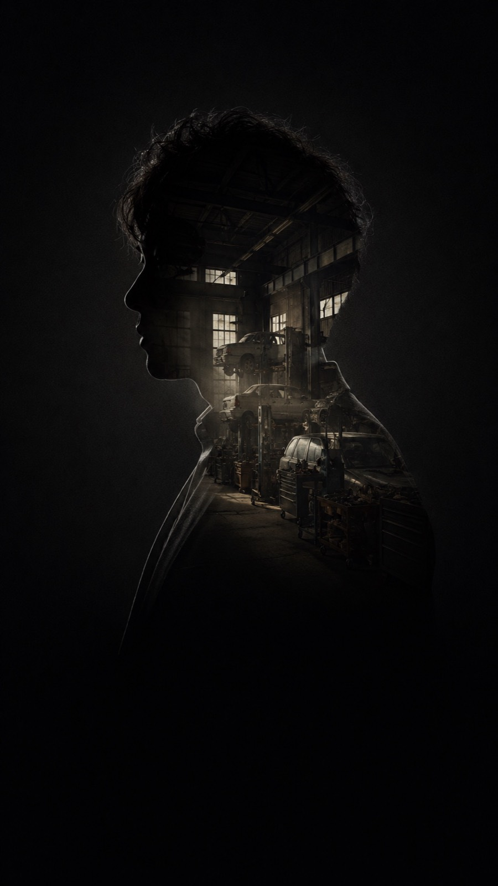

# BrightCard 差別化ライン再設計仕様書
## onyx / alloy / kiln / flux / kinari — 「標準のリッチさ＋さらに上」への章再構成

- 対象: `/Users/kemmei/wbt.company/digital-namecard/members/_assets/runtime/v1/templates/{onyx,alloy,kiln,flux,kinari}.{js,css}`
- 設計: Fable（2026-07-22）。実装は次工程 Sonnet。
- 前提資料: `BRIGHTCARD-TEMPLATE-DESIGN.md`（§3差別化ライン・§6価格）、実機診断（2026-07 オーナー承認済み方針）
- 価格の現実: 差別化=主力"竹"（黒¥6,900〜アルミ¥7,900）。標準（¥4,900〜5,900）より**視覚的に上**でなければ商品として成立しない。

---

## 1. 再設計コンセプト

### 一言価値
**「あなたの紙名刺が、一冊の作品集になる」** — 標準が"1枚の額装写真"なら、差別化は"表紙（顔）から始まる章立ての本"。

### 何が問題だったか（確定診断）
1. 現行は 00 Card Intake（名刺スキャン演出＋EXTRACTED FIELDS表）で開幕 → **最初に見えるのが処理デモとフォーム然とした表**。顔写真は 01 章の 96px 円形アバターのみ。
2. 標準 bright は開幕から 100svh・幅64%・3:4 の額装ポートレート＋シネマグラデーション。**安い方が第一印象で勝っている**。
3. 差別化の売り（紙名刺→AI抽出→章立て再構成）が「写真が小さい・表がチープ」に翻訳されていた。

### 格差の作り方（3原則）
| 原則 | 具体 |
|---|---|
| **①第一印象は標準と同等以上** | 01章を 100svh 級・大判ポートレートヒーロー化。標準の「額装＋グラデ」に対し、差別化は「素材(黒曜石/アルミ/陶土/ネオン/和紙)の額装＋章装置（章番号・ゴーストナンバー・罫線）」で"編集された誌面"の格上感を出す |
| **②情報量＝上位感** | 標準に無い章を積む: 02 Proof（大数字カウンター）、03 Story（about+philosophy+businesses を編集的に）。「高い方がページが深い」を一目でわかる形に |
| **③名刺リビールは"処理デモ"から"物語の山場"へ** | 紙名刺モック（既存の傑作パーツ）は04章へ後送。素の抽出表は**廃止**し、「紙の名刺 → 同素材のデジタル銘板」への変身演出に置換。Before/Afterで差別化の物語的アイデンティティを保持したまま高級化 |

### 章構成（確定）
```
01 Portrait   顔写真ヒーロー（大・シネマティック・100svh級）      … 常時表示
02 Proof      実績・数字（metrics 大型カウンター）               … metrics無ければスキップ
03 Story      物語・事業（about / philosophy / businesses / links）… 全て空ならスキップ
04 Reveal     名刺が生まれ変わるリビール（紙→デジタル銘板）       … 常時表示（name.jaのみで成立）
05 Save       連絡先に保存（contact行 + vCard + 共有 + QR）       … 常時表示
```
- **章番号は動的採番**（スキップ章があれば詰める。例: metrics無し→ Story が「02」になる）。ゼロ埋め2桁。
- 章の英ラベル: `Portrait / Proof / Story / Reveal / Save & Connect`。
- **「00 Card Intake」章・「Extracted Fields」表・信頼度%カウンターは全廃**（フィールド名 `Name/Role/…` のグリッド表を出さない）。
- 既存の章装置（`sec-head`=章番号+ラベル、`ghost`=巨大ゴースト数字、`rule`=罫線、noise オーバーレイ、SNS FAB、toast、フッターC規約）は**続投**。これらは差別化の誌面らしさの核であり変更しない（ghost の数字テキストのみ動的採番に追従）。

---

## 2. 共通章設計（全5テンプレ共通のDOM/挙動。スキンは§3）

実装は現行と同じ「onyx を正パターンとして書き、他4テンプレへ `bc-onyx-` → `bc-<tpl>-` 置換＋スキン差分」方式を踏襲する。`render(card, photoBase64, core, icons)` 契約・`window.BrightCardTemplates.<name>` 登録・`el()`ヘルパ・`CHAN_STYLE`・FAB・toast・フッターはそのまま流用。

### 2.0 動的採番ヘルパ（各テンプレJS内・共通ロジック）
```js
var chapterNo = 0;
function chap() { chapterNo += 1; return (chapterNo < 10 ? "0" : "") + chapterNo; }
function secHead(no, label) {  // 既存 sec-head + ghost をまとめて生成
  return [
    el("div", { class: "bc-<tpl>-ghost", "aria-hidden": "true", text: no }),
    el("div", { class: "bc-<tpl>-sec-head" }, [
      el("span", { class: "bc-<tpl>-chapno", text: no }),
      el("span", { class: "bc-<tpl>-sec-label", text: label }),
    ]),
    el("hr", { class: "bc-<tpl>-rule" }),
  ];
}
```
※ ヒーロー(01)だけは `rule` を出さない（現行踏襲: hero に hr 無し）。

### 2.1 — 01 Portrait（顔写真ヒーロー）★最重要

**目的**: 開いた瞬間に「標準より上」。額装ポートレート＋氏名タイポ＋タグラインを1画面に。

**レイアウト（共通骨格）**:
```
<section class="bc-<tpl>-section bc-<tpl>-hero" id="bc-<tpl>-hero">   … min-height: 100svh / padding-top: 28px / flex column
  ghost("01") + sec-head("01", "Portrait")                            … 章装置は上端に小さく
  <div class="bc-<tpl>-hero-media">                                    … 大判写真フレーム（テンプレ別構図 §3）
      ／ onerror → <div class="bc-<tpl>-hero-monogram">頭文字</div>
  </div>
  <div class="bc-<tpl>-hero-id">                                       … 氏名ブロック
    role tag（positions[0].role・小・トラッキング広）
    <h1> name.ja（大・clamp(38px, 13vw, 60px)。縦書きkinariは§3）
    name.kana よみ／name.en（小キャップス）
    role-line（positions 全件の「会社 ／ 役職」連結・現行 buildRoleLine 続投）
    tagline（accent罫付き引用体・現行スタイル続投）
  </div>
</section>
```

**hero-media の共通仕様**:
- コンテナ `max-width:480px` の中で **幅 `calc(100% + 40px)`・`margin: 0 -20px`（ブリード）または幅100%の額装**（どちらかはテンプレ別 §3）。
- `aspect-ratio: 3/4`（kinari のみ 3/4 縦・横幅58%）。`img { width:100%; height:100%; object-fit:cover; }`、`object-position` は `design.photoPosition`（現行どおり）。
- **アスペクト比コンテナ必須**（画像読込前後でレイアウトジャンプさせない）。
- 写真なしフォールバック: 現行の 96px 円形モノグラムではなく、**hero-media 全面モノグラム**（標準 bright の `bc-monogram` と同格）。`radial-gradient(accent-light → bg)` 地に頭文字を `min(30vw, 160px)`・serif・accent色・opacity .35 で中央配置。
- 現行 01 章の 96px `avatar-wrap` は**廃止**（hero-media に置換）。

**エントランスモーション（ロード時1回・IO不要）**:
- `hero-media`: `opacity 0→1`＋`transform: scale(1.045)→scale(1)`、1.1s `cubic-bezier(0.22,1,0.36,1)`。CSSアニメーション（`animation: bc-<tpl>-hero-in 1.1s both`）。
- `hero-id` 内の行: `opacity 0 / translateY(14px)` → 順に表示。CSSアニメーション `both` + `animation-delay: 0.25s / 0.35s / 0.45s / 0.55s`（クラス `bc-<tpl>-hi-1..4` を行に付与）。
- reduced-motion: `animation: none`＋最終状態（既存の全停止メディアクエリに乗る）。

**コピー方向**: ヒーローに説明文は置かない。写真・名前・タグラインだけで語る（標準と同じ潔さ＋章装置で誌面感）。

### 2.2 — 02 Proof（実績・数字）

**目的**: 標準に存在しない「実績の章」で情報量の上位感を作る。metrics を"スペック表"でなく"見出し級の数字"として魅せる。

- **データ**: `card.metrics[]`（既存任意フィールド）。`{value:N, suffix:"…", label:"…"}` はカウントアップ、`{static:"…", label:"…"}` は静的表示。**metrics が0件なら章ごとスキップ**（採番も飛ばす）。
- **レイアウト**: 先頭1件をフィーチャー（全幅・数字 `clamp(48px, 16vw, 72px)`）、2件目以降は2カラムグリッド（数字 `clamp(30px, 9vw, 40px)`）。現行の枠borderカード（`proof` 12px角丸パネル）は**廃止**し、罫線区切りのタイポグラフィ主体へ（枠箱＝フォーム感の残滓を除去）。各項目は `padding: 18px 0; border-top: 1px solid <line>`（フィーチャーのみ border 無し）。
- **static 長文対策**: `m.static` が5文字超なら数字要素に `bc-<tpl>-num-long` を付与し1段階縮小（フィーチャー `clamp(34px,10vw,48px)`／グリッド `clamp(22px,6.5vw,28px)`）。`±0.01mm`「呉服・和装」等の非数値 static が既存デモに存在するため必須。
- **モーション**: 章がIO（threshold 0.35・1回）に入ったら (a) 各項目 `opacity/translateY(14px)` reveal を 90ms ステップで stagger、(b) `value` 系は既存 `countUp()`（rAF・cubic ease-out・1100ms）発火。数字下の細い accent 罫を `transform: scaleX(0)→1`（transform-origin:left・0.7s）。
- **reduced-motion**: 最終値を即時静的表示（既存 countUp の reduce 分岐続投）・reveal無し。
- **コピー方向**: 章リード1行（任意・固定文言）「数字で見る、これまでの歩み。」程度。ラベルは card.js の `label` をそのまま。

### 2.3 — 03 Story（物語・事業紹介）

**目的**: about だけだった Story を"編集記事"へ拡張。**現行差別化が捨てていた `philosophy` と `businesses[]`・`links[]` を使う**（=標準が持つ情報スロットを差別化も全部使い、さらに章として上質に組む）。

- **表示条件**: `about` / `philosophy.text` / `businesses[]` / `links[]` のいずれかが非空なら表示。全て空ならスキップ。
- **構成（上から）**:
  1. **リード段落** = `about`。ドロップキャップ風に先頭を大きく…はやらない（多言語・記号開始で崩れる）。代わりに `font-size 15.5px / line-height 2.05 / max-width 40em` の読ませる組版＋左に accent の縦罫（2px）で引用格。
  2. **philosophy**（あれば）= 章中のプルクオート。`philosophy.label`（小キャップス・accent）＋ `philosophy.text`（serif・19〜21px・広字送り）。枠箱にせず、上下に細罫。
  3. **businesses[]**（あれば）= 編集的リスト行。各行: 左に2桁連番（`01.` serif・accent）、中央に `name`（太）＋ `role`（小）＋ `desc`（12.5px・dim）、`tags[]` は細字インライン（`・`区切り、チップ枠なし）。`url` があれば行全体を `<a>`＋右端に `icons.contact.externalLink`。`image` は使わない（章の誌面統一を優先。標準のカード型と差別化するため）。
  4. **links[]**（あれば）= businesses の後に小さめ同形式（ラベル＋desc・外部リンク矢印）。
- **モーション**: 各ブロックに `.reveal` を付け、**core.initScrollReveal を採用**（差別化テンプレで初導入。`.reveal{opacity:0;transform:translateY(18px);transition:.6s}` `.visible` で解除、を各テンプレCSS内に `.bc-<tpl>-root .reveal` としてスコープ定義）。独自IOは 02 Proof / 04 Reveal 用に限定。
- **コピー方向**: 見出し等の固定文言は入れない（card.js のデータのみで組む）。

### 2.4 — 04 Reveal（名刺が生まれ変わるリビール）★差別化の魂・EXTRACTED FIELDS の代替

**目的**: 「紙名刺を撮るだけで、この一冊になった」という差別化の物語を、**処理デモではなく変身の儀式**として中盤に置く。素のデータ表は出さない。

**DOM**:
```
<section class="bc-<tpl>-section bc-<tpl>-reveal" id="bc-<tpl>-reveal">
  ghost + sec-head("0N", "Reveal") + rule
  <p class="bc-<tpl>-reveal-copy">1枚の紙の名刺から、このページは生まれました。</p>
  <div class="bc-<tpl>-stage" id="bc-<tpl>-stage">          … 既存 capture の暗い撮影台を継承（reticle四隅も継承可・テンプレ別）
    <span class="bc-<tpl>-scan">                             … 既存スキャンライン（1回）
    <div class="bc-<tpl>-meishi bc-<tpl>-meishi-paper">      … 既存の紙名刺モック（DOM/スタイルほぼ現行のまま流用）
      m-accent / m-role / m-name / m-en / m-div / m-line×N   … meishiLines（Co/Tel/Mail/Web）現行導出を流用
    </div>
    <div class="bc-<tpl>-plate">                             … ★新設「デジタル銘板」= 紙名刺の生まれ変わり
      <span class="bc-<tpl>-plate-accent">                   … accent の光る縁 or 落款（テンプレ別 §3）
      <div class="bc-<tpl>-plate-name">name.ja</div>          … serif 大（26〜30px）
      <div class="bc-<tpl>-plate-en">NAME EN</div>
      <div class="bc-<tpl>-plate-role">role ／ company</div>
      <div class="bc-<tpl>-plate-rows">                      … 最大3行: Tel / Mail / Web（あるものだけ・小さく上質に）
      <div class="bc-<tpl>-plate-badge">BrightCard ── 章立てデジタル名刺</div>
    </div>
  </div>
  <div class="bc-<tpl>-reveal-cap">紙の名刺が、章立ての一冊に。</div>
</section>
```
- **plate は"表"ではない**: ラベル列を持つグリッドにしない。名刺と同じ情報を、そのテンプレの素材（黒曜石板/削り出しアルミ/釉薬タイル/発光ガラス/和紙短冊）の上に**名刺として組版**する。Before（紙）/After（銘板）の対比が演出の全て。
- **plate の内容導出**: 既存 `meishiLines` と同じソース（primary.role/company, contacts.phone/email/website の displayUrl）。全て空でも name.ja だけで成立。
- **リビール・コレオグラフィ（IO threshold 0.4・1回のみ・`runReveal()`）**:
  1. 0ms: `stage` に `bc-<tpl>-scanning` 付与 → 既存スキャンライン keyframe（1.7s・1回）発火。
  2. 500ms: 紙名刺が退く — `.bc-<tpl>-paper-out` 付与: `transform: rotate(-1.5deg) → rotate(-4deg) translate(-14px, 10px) scale(0.92)`、`opacity: 1 → 0.28`、transition 0.9s `cubic-bezier(0.4,0,0.2,1)`。**紙は消さない**（Before として画面に残す。重ね置きの「机の上」感）。
  3. 900ms: 銘板が立ち上がる — `.bc-<tpl>-plate-on` 付与: `opacity 0→1`＋`transform: translateY(26px) rotate(1.2deg) scale(0.96) → none`、0.9s 同ベジェ。銘板は紙名刺に**半分重なる**配置（`margin-top: -34px; margin-left: 18px;` 目安）で "上に生まれた" を表現。
  4. 銘板内の行: `opacity/translateY(8px)` を CSS `transition-delay`（+0.10s刻み・`plate-on` 連動）で name → en → role → rows → badge の順に stagger。
  5. 2200ms: `reveal-cap` fade-in（`.reveal` でも可）。
  - 実装は `setTimeout` 2本（500/900ms）＋クラス付与のみ。rAF連続駆動やスクロール連動スクラブは**しない**（中位Android配慮）。
  - 再入場しても再生しない（既存 `intakeDone` 同様の `revealDone` フラグ）。
- **reduced-motion**: スキャンライン非表示（既存どおり）。紙=退き終わり状態・銘板=表示済み状態を初期スタイルで静的に出す（`@media (prefers-reduced-motion: reduce)` で `.bc-<tpl>-meishi-paper{opacity:.28; transform:rotate(-4deg)…}` `.bc-<tpl>-plate{opacity:1; transform:none}` を直接指定）。JS 側は `reduce` なら即クラス付与のみ。
- **廃止確認**: `extract` / `extract-rows` / `field` / `k` / `v` / `c` / `fieldConf` / `runIntake` の信頼度カウント一式は**コードごと削除**。

### 2.5 — 05 Save & Connect（連絡先に保存）

現行 03 章をほぼ続投＋QR追加。
- contact 行（Phone/Mail/Web/Address・現行の `crow` リスト）続投。
- `保存（vCard）` primary ボタン＋`このカードを共有` ghost ボタン続投（share/clipboard/toast ロジック不変）。
- **QR opt-in**: `core.renderQr(card)` が非null（= `card.qr.svg` あり）なら contact リストの下に挿入し、各テンプレCSSで `.bc-<tpl>-root .bc-qr / .bc-qr-code / .bc-qr-cap` を装飾（クリーム地パネル・角丸14px・コード上限180px・キャプション小）。null なら非表示（現行デモは qr 未定義なので出ない。将来 `tools/qr.sh mecard` 生成分で点灯）。
- フッターC規約（`© YYYY 氏名` + Powered by BrightCard）不変。

### 2.6 SNS FAB・toast・noise
現行実装を無変更で続投（alloy/onyx/flux/kiln=4ch、kinari=3ch のスライス数も現状維持）。

---

## 3. テンプレ別差分（5つは"レイアウトごと別物"を維持）

### 3.1 ヒーロー構図・素材差分表

| | **onyx**（黒曜石・重厚） | **alloy**（アルミ・精密） | **kiln**（陶土・温） | **flux**（夜光・先鋭） | **kinari**（和紙・縦組み） |
|---|---|---|---|---|---|
| **hero-media 構図** | **全幅ブリード**（margin:0 -20px）3:4。写真下端→背景へ黒グラデで溶かす（`::after` に `linear-gradient(transparent, var(--bg))`）。額装は極細 1px の内側 accent 罫（`outline: 1px solid accent-border; outline-offset:-14px`）＝美術館の額 | **削り出しプレート額装**（幅100%・3:4・radius 10px）。フレームに現行 meishi のアルミ縁を移植: `border:1px solid #cfd6dc` 系＋ヘアライン縦筋 `::before`（repeating-linear-gradient）＋上辺ハイライト。四隅に**ネジ頭ドット**（6px円・radial-gradient）4個 | **厚マット台紙額装**（幅100%・3:4）。写真の外に `padding:10px` のクラフト紙マット（panel色）＋`box-shadow` 2段で"貼り込み"感。radius 4px と直線的 | **全幅ブリード** 3:4。四隅に既存 reticle（accentネオン枠）を**ヒーローへ移設**＋写真全周に `box-shadow: 0 0 34px -10px accent-glow`。ロード時スキャンライン1回を写真上でも実行（既存keyframe流用） | **縦長 3/4・幅58%を左置き**、右に**縦書き氏名ブロック**（現行 tategaki 続投）を並べる2カラム（flex row-reverse 現行流儀）。写真枠は washi 額装（`border:1px solid #b9ad8e`＋`outline` 二重罫）＋右下に**落款シール**（現行 seal 42px）を写真に半重ね |
| **hero-id 配置** | 写真グラデ上に重ねず、写真の**下**に密着配置（黒地に白serif） | 写真の下。名前はゴシック900（Zen Kaku）＋精密な字間 | 写真の下。土色地に焦茶serif | 写真の下。名前に `text-shadow: 0 0 24px accent 25%`（現行踏襲） | 縦書き氏名が写真右（=ヒーローの主役はタイポと写真の対）。en/roleLine は下段横組み |
| **name.ja サイズ** | clamp(40px,14vw,64px) serif 800 | clamp(38px,13vw,60px) sans 900 | clamp(38px,13vw,58px) serif 800 | clamp(36px,12.5vw,58px) sans 900 | 縦書き clamp(34px,12.5vw,56px)（現行値） |
| **背景/地** | #0a0a0a・noise screen | #101215・noise screen | #efe7d8・noise multiply | #06080c・noise screen＋薄グリッド地（`repeating-linear-gradient` 22px・opacity .04 を hero にのみ） | #eae4d6・noise multiply |
| **フォント** | Shippori Mincho B1 ×Space Grotesk | Zen Kaku Gothic New ×Space Grotesk | Shippori Mincho B1 ×Space Grotesk | Zen Kaku ×Space Grotesk＋**Space Mono**（章番号・数字） | Shippori Mincho B1 ×Space Grotesk |
| **既定 accent** | #e8703a（橙） | #6E8BA6 / 注入既定 #6fa8d6（スチール青） | #b5602f（焦茶） | #34e6b4（発光ミント） | #35506b / デモ #8A9A5B（藍・利休） |

### 3.2 02 Proof の数字表現差分

| | 数字の書体・装飾 |
|---|---|
| onyx | serif 800。数字下に accent 細罫 scaleX。ラベルは小キャップスsans |
| alloy | sans 900・tabular-nums。数字の後に**単位を刻印風小文字**。罫は #cfd6dc 系ヘアライン |
| kiln | serif 800・焦茶。罫は土色の破線（`border-top:1px dashed`） |
| flux | **Space Mono**・text-shadow glow（現行 num の glow 続投）。罫は accent 1px＋glow |
| kinari | serif 800・藍。フィーチャー数字の右肩に小さな落款風 accent 正方形 8px |

### 3.3 04 Reveal の「銘板」素材差分

| | plate の素材表現 |
|---|---|
| onyx | 漆黒鏡面: `linear-gradient(160deg,#181816,#0c0c0b)`＋上辺1pxハイライト＋左端 accent 5px（紙名刺の m-accent と対）。文字は ink 白serif |
| alloy | ブラッシュドアルミ: 紙名刺（bc-alloy-meishi）と**同じアルミ地グラデ＋ヘアライン::after を反転トーンで**（少し明るく・青みに）。「紙→金属板」の物質変化を見せる |
| kiln | 釉薬タイル: panel色地＋`radial-gradient` の釉だまり風ハイライト＋角 radius 8px。焦茶の縁 |
| flux | 発光ガラス: `linear-gradient(160deg,#0f1620,#0a0f16)`＋`border:1px solid accent 35%`＋`box-shadow: 0 0 24px -10px accent-glow`（現行 flux-meishi の意匠を plate 側の正装に昇格。紙側 flux は白紙名刺に変更…は**しない**。flux の Before は現行ダークカードのまま、After はより強い発光＋グリッド地で「点灯した」を表現） |
| kinari | 和紙短冊+落款: 生成り紙地（現行 meishi 地）＋右下に seal（accent 正方形・頭文字）＋文字は縦書きにしない（可読優先・横組みserif） |

### 3.4 その他の個性維持
- 章装置（chapno/sec-label/ghost）の書体は現行どおりテンプレ別（flux のみ mono 等）。
- kinari はヒーローが縦書きのため、`hero-id` の stagger は縦書きブロック→seal→en→roleLine の順。
- ボタン・FAB・toast の配色は現行値を維持（変更不要）。

---

## 4. データスキーマ（使用フィールドとフォールバック）

### 4.1 使用フィールド一覧（すべて既存・破壊的変更なし）
| 章 | フィールド | 無い場合 |
|---|---|---|
| 01 Portrait | `name.ja`(必須) / `name.en` / `name.kana` / `positions[]` / `tagline` / `design.photoPosition` / photo.jpg | en/kana/tagline→行非表示。positions空→role行非表示。photo無→全面モノグラム |
| 02 Proof | `metrics[]`（`{value,suffix,label}` or `{static,label}`） | 0件→**章スキップ＋採番詰め** |
| 03 Story | `about` / `philosophy.{label,text}` / `businesses[]`（name,role,desc,tags,url） / `links[]`（label,desc,url） | 個別非表示。全部空→章スキップ |
| 04 Reveal | `name.*` / `positions[0]` / `contacts.{phone,email,website}` | 行単位で非表示。name.jaのみでも成立 |
| 05 Save | `contacts.*`（address含む） / `vcard.*` / `qr.svg` | 行単位非表示。qr無→QRパネル非表示 |
| FAB | `sns[]` | 0件→FAB非表示（現行どおり） |
| 全体 | `design.accent` → `core.deriveAccentPalette` | テンプレ別既定色（現行値）へフォールバック |

### 4.2 任意の追加フィールド提案（追加のみ・無くても完全動作）
```js
// card.js（すべて省略可）
reveal: {
  copy: "…",     // 04章リード文の差し替え。無ければ既定文言
  caption: "…",  // 04章末キャプション差し替え。無ければ既定文言
},
```
- 既定文言: copy=「1枚の紙の名刺から、このページは生まれました。」／caption=「紙の名刺が、章立ての一冊に。」
- これ以外の新フィールドは**追加しない**（philosophy/businesses/links の活用で情報量は足りる。スキーマ肥大は正本規則違反リスク）。
- `core.validateCard` の警告文はそのままで互換（validTemplates 変更なし）。

---

## 5. モーション設計（CSS + IntersectionObserver + rAF のみ）

### 5.1 使用技術の割当（禁止技術ゼロの確認込み）
| 演出 | 実装 | 備考 |
|---|---|---|
| 01 ヒーローエントランス | CSSアニメーション（ロード時1回・`both`・delay stagger） | JS不要。transform/opacityのみ |
| 03 章内ブロック reveal | `core.initScrollReveal`（IO・`.reveal`→`.visible`） | `.reveal` スタイルは各テンプレCSSにスコープ定義 |
| 02 カウントアップ | 既存 `countUp()`（**rAF**・1100ms・cubic ease-out）＋IO threshold 0.35 発火 | `data-to/data-suffix/data-static` 現行属性を続投 |
| 02 accent罫 | `transform: scaleX(0)→1` transition（IO発火クラス） | layoutプロパティは動かさない |
| 04 スキャンライン | 既存 `@keyframes bc-<tpl>-scan`（1.7s・1回） | 現行流用 |
| 04 紙→銘板 | クラス2段付与（setTimeout 500/900ms）＋CSS transition（transform/opacity・0.9s）＋`transition-delay` stagger | スクロール連動スクラブ禁止・1回のみ |
| FAB/toast | 現行 transition 続投 | 変更なし |
- **禁止**: GSAP / ScrollTrigger / WebGL / backdrop-filter を一切使わない（現行差別化CSSにも無し・維持）。`filter` のアニメーションも使わない（blur代替は opacity で表現）。
- パフォーマンス: アニメ対象は `transform`/`opacity` のみ。`will-change` は `hero-media` と `plate` の2箇所まで。IOは章単位2個（Proof/Reveal）＋initScrollReveal の計3系統・全て `unobserve` で解放。スクロールごとのJS実行は0（progress bar非採用のまま）。

### 5.2 reduced-motion（`prefers-reduced-motion: reduce`）
既存の全停止ブロック（`animation:none!important; transition-duration:0.001ms!important`）を継承しつつ、以下を明示追加:
- ヒーロー: エントランス無し・最終状態。
- カウンター: `countUp()` の reduce 分岐で最終値即時表示（既存実装）。
- 04: スキャンライン `display:none`（既存）＋紙=退き済み/銘板=表示済みを静的指定（§2.4）。JSは `reduce` フラグで即クラス付与。
- `.reveal { opacity:1; transform:none; }` をスコープ内で指定。

---

## 6. 実装への申し送り（次工程 Sonnet 向け）

### 6.1 触るファイル（これ以外は触らない）
```
members/_assets/runtime/v1/templates/
  alloy.js  alloy.css      ← ★最初に試作
  onyx.js   onyx.css
  flux.js   flux.css
  kiln.js   kiln.css
  kinari.js kinari.css
```
- **boot.js / core.js / icons.js / 各会員・デモの card.js は変更禁止**（validTemplates・テンプレ名5種は不変。中身だけ再設計）。
- QRは `core.renderQr(card)` 呼び出し＋テンプレCSSで `.bc-qr*` を装飾するだけ（core改修不要）。

### 6.2 段階（推奨手順）
1. **Phase 1: alloy 1枚を試作**。`members/demo-alloy/index.html` を file:// で開いて確認（metrics 4件・鈑金デモが揃っており検証に最適）。オーナーの実機スクショOKが出るまで他テンプレに着手しない。
2. **Phase 2: onyx / flux へ展開**（同じダーク系・置換量が少ない）。flux はヒーロー reticle 移設と mono 数字に注意。
3. **Phase 3: kiln / kinari へ展開**（ライト系。影・noise の blend が multiply である点、kinari の縦書きヒーロー2カラムに注意）。
4. 各 Phase で該当 `demo-*` と `cmp-*` を目視 → 最後に `_catalog.html` で11枚一覧確認。
5. デプロイは正本規則どおり（`runtime/v1` はバグ修正原則の対象だが、本件はオーナー承認済みの意匠再設計＝例外として v1 内更新。公開前に清田さん確認必須）。

### 6.3 実装時の注意（ハマりどころ）
- 5テンプレは「onyx 正パターン→クラス接頭辞置換＋スキン差分」の流儀を維持する（kinari のヒーローと FAB 3ch、flux の mono など既存差分に本仕様§3の差分を重ねる）。
- ルート要素（`.bc-<tpl>-root`）への背景色必須（既存教訓コメント: 短いカードで下部が白くなる）。
- ヒーローのブリード（margin:0 -20px）は `.bc-<tpl>-app { overflow:hidden }` の内側なので横スクロールは発生しないが、**iPhone SE幅(375px)/390px で必ず確認**。
- `photo.jpg` の `onerror` フォールバックはモノグラム二重挿入ガード（`monogramShown`）を踏襲。
- 04 の `setTimeout` はIO発火後にのみ走らせ、`revealDone` ガードで多重発火防止。
- 銘板の重ね配置（negative margin）は stage の `overflow:hidden` 内で完結させ、`padding` を十分確保（紙が回転しても切れないように stage padding 30px 24px → 34px 24px 目安）。
- 削除漏れ注意: `fieldConf` / `fieldsData` / `extract*` / `runIntake` / 「写真付きの名刺を読み取り…」コピー / `Extracted Fields` 文字列が5ファイルどこにも残らないこと。

### 6.4 検証チェックリスト（全項目必須）
- [ ] **顔ヒーローが標準以上**: demo-alloy と demo-bright を並べ、第一印象で差別化が上に見える（写真面積・額装・タイポ）
- [ ] **EXTRACTED FIELDS 表が消えた**: 5テンプレ全部で grep `Extracted` ヒット0・素の表DOMなし
- [ ] **04 リビール**: スキャン1回→紙が退き→銘板が立つ。再スクロールで再発火しない
- [ ] **5テンプレの個性**: 5枚を横に並べ「レイアウトごと別物」に見える（§3表どおり）
- [ ] **章の動的採番**: metrics を空にした card.js で Story が 02 になり ghost も追従
- [ ] **フォールバック**: photo.jpg 削除→全面モノグラム／metrics空→章スキップ／about+philosophy+businesses+links空→Story消滅／sns空→FABなし／qr無→QRパネルなし
- [ ] **禁止技術ゼロ**: 5cssで grep `backdrop-filter` ヒット0・GSAP/WebGL不使用・アニメは transform/opacity のみ
- [ ] **reduced-motion**: macOS「視差効果を減らす」で全停止・カウンター静的・銘板静的表示
- [ ] **表記**: 「鈑金」（「板金」grep 0）／「Kemmei Kiyota」（「Kenmei」grep 0）／「合同会社WBT」／ダミー連絡先 example.jp
- [ ] **From WBT枠なし**: フッターは `© YYYY 氏名`＋Powered by のみ
- [ ] **デモ11人で崩れない**: `_catalog.html` 全11枚＋`cmp-*` 表示・375px/390px/430px 幅・長い会社名（〜25字）・positions 4件・sns 0〜4件
- [ ] **vCard/共有/QR**: 保存ボタン動作・share/clipboard toast・（qr投入時）Scan to save パネル表示
- [ ] **中位Android体感**: スクロール中のjankなし（Moto G相当のCPUスロットリング4xで確認）

---

*設計: Fable 5（2026-07-22）／承認済み方針: 清田兼明（Kemmei Kiyota）・合同会社WBT*
